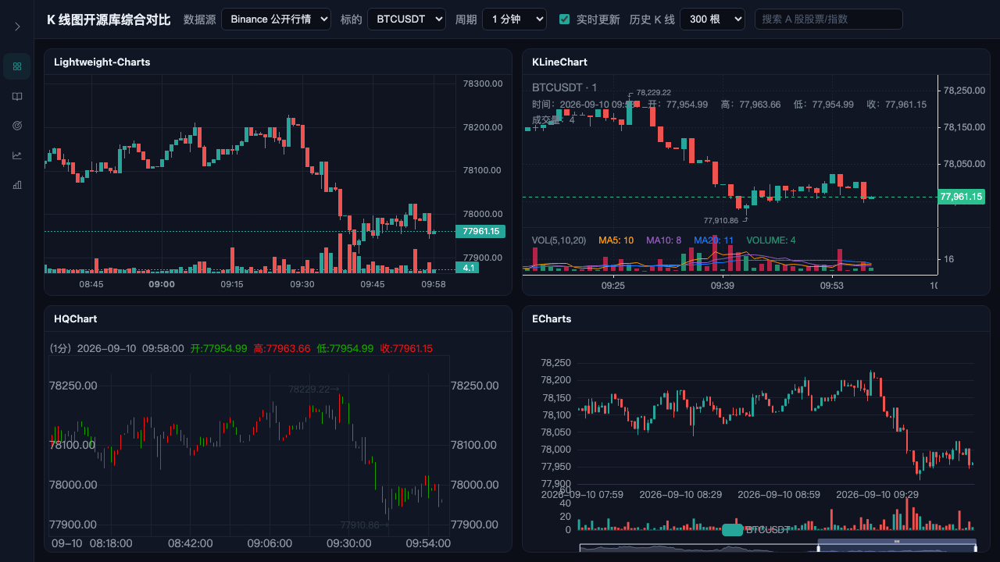
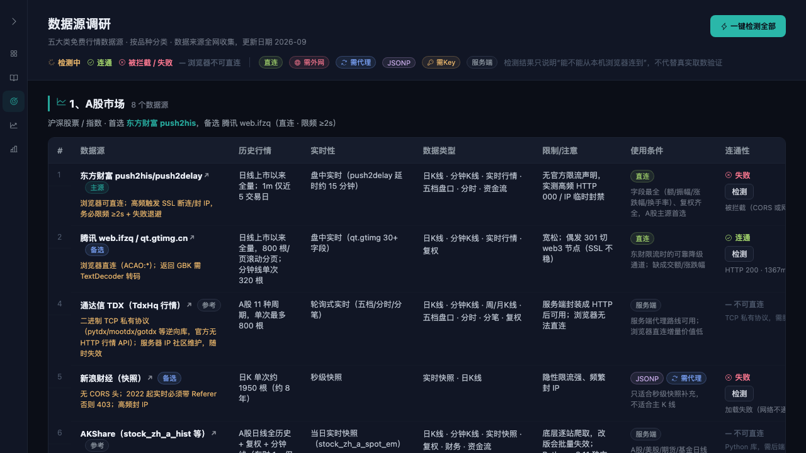
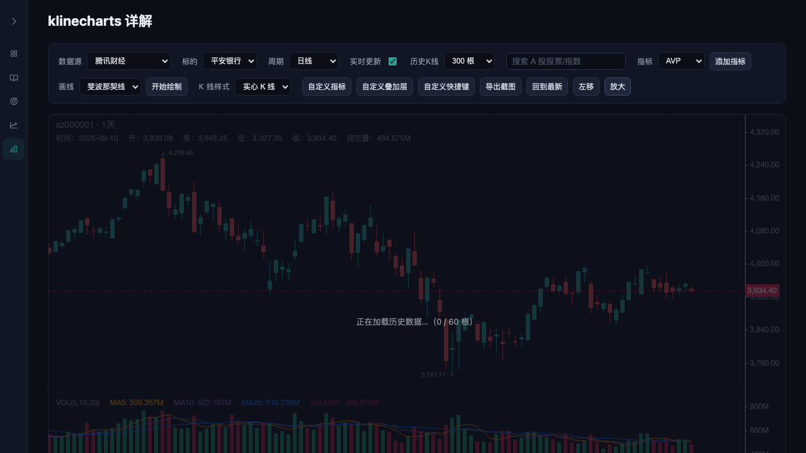

<div align="center">

# 📈 KLineChart FreeData Research Hub

**K 线图开源库综合对比平台 · 免费行情数据源调研中心**

同一份**实时 K 线数据**，同源喂给 **4 个开源图表库**横向评测渲染与交互差异；
并内置 **5 大市场免费数据源调研** 与 **一键连通性检测**。

<sub>Vite + React 19 + TypeScript · 腾讯/东方财富/币安多源实时行情 · Playwright 冒烟测试</sub>

</div>

---

## ✨ 功能总览

| 页面 | 说明 |
|---|---|
| 📊 **多图对比** | 同一份实时 K 线数据同源喂给 4 个库横向对比：渲染效果 / 交互差异 / 数据一致性 |
| 📖 **图表调研** | 开源图表库选型调研报告（lightweight-charts / KLineChart / HQChart / ECharts / uPlot…），含功能矩阵、优缺点、技术路线建议 |
| 📡 **数据调研** | A股 / 美股 / 加密货币 / 期货 / 基金 **五大市场 40 个可用免费数据源**（已剔除停服/反爬/不提供实时行情的源）按角色与历史 K 线能力排序，名称点击直达官网/开源仓库，**每源一键连通性检测 + 一键检测全部** |
| 📖 **轻量库详情** | Lightweight-Charts 单库详解：全功能大图（序列/指标/标记/水印/趋势线/价格线/多面板功能开关）+ 分节库文档，首节「功能总览」将全部功能点表格化集中展示 |
| 📖 **K线库详情** | klinecharts 单库详解：结构同上，功能开关含 20+ 内置指标 / 画线工具 / 周期切换 / 副图多面板，首节「功能总览」同样表格化集中展示 |

### 四大图表库

| 库 | 渲染 | 特点 |
|---|---|---|
| **Lightweight-Charts** (TradingView) | Canvas | 金融图表事实标准，极轻量，行业范式 |
| **KLineChart** | Canvas | 开箱即用，内置 20+ 指标 / 画线 / 周期切换 |
| **HQChart** | Canvas | 通达信 / 麦语言脚本，多市场覆盖，A股最强 |
| **Apache ECharts** | Canvas + SVG | 全能图表库之王，作为通用对照 |

---

## 🖼️ 页面预览

**📊 多图对比 —— 4 库同源数据横向评测**



**📡 数据调研 —— 五大市场免费数据源 + 连通性检测**



**📖 单库详解 —— 全功能大图 + 表格化文档（轻量库 / K线库同构）**



---

## 🧭 目录导航

```
src/
├── App.tsx                    # 侧边栏 + 五页切换（切页卸载/重挂载）
├── pages/
│   ├── Dashboard.tsx          # 📊 多图对比（多源轮询订阅主逻辑）
│   ├── ResearchReport.tsx     # 📖 图表调研报告
│   ├── DataResearch.tsx       # 📡 数据调研页（连通性检测）
│   ├── LightweightShowcase.tsx / .css  # 📖 轻量库详解页（大图 + 功能总览文档）
│   ├── KlinechartsShowcase.tsx / .css  # 📖 K线库详解页（大图 + 功能总览文档）
│   ├── showcaseShared.ts      # 两详页共享逻辑：控件 + 大图 stage + 底部 loading/错误条
│   └── dataResearchData.ts    # 数据源元数据注册表（61 源，页面只展示 40 个可用源）
├── components/
│   ├── Icon.tsx / phosphorIcons.ts  # 全站图标：本地打包 Phosphor 图标（MIT，不依赖在线 API）
│   └── charts/               # 4 库图表适配层 + 两详页图表（踩坑重灾区）
├── data/
│   ├── tencent.ts            # 数据源适配器：腾讯财经（REST + 轮询 + 竞态守卫）
│   ├── eastmoney.ts          # 东方财富数据源适配器
│   ├── binance.ts            # 币安数据源适配器
│   ├── tdx.ts                # 通达信数据源适配器（占位，浏览器端不可用）
│   ├── aShareSearch.ts       # A 股搜索：东财 suggest JSONP + 腾讯 smartbox 双源兜底
│   ├── connectivity.ts       # 连通性检测：fetch / JSONP / 服务端库判定
│   └── index.ts              # 数据源注册表
└── types/ohlcv.ts             # 全项目统一协议 OHLCV
docs/
├── 图表库调研报告.md            # 选型调研（stars/协议/四大库优劣势）
├── 免费行情数据源调研报告.md     # 五大市场免费数据源实测调研
├── Lightweight-Charts 详细功能点整理.md   # 轻量库详解页文档源稿（页面首节「功能总览」即此整理）
├── KLineChart(klinecharts) 详细功能点整理.md # klinecharts 详解页文档源稿
└── img/                        # README 预览图
```

**核心协议 `OHLCV`**：`{ time, open, high, low, close, volume }` —— 所有数据源适配器返回它，所有图表库适配器消费它。新增数据源只需实现 `KlineDataSource` 接口并在 `src/data/index.ts` 注册。

---

## 🚀 快速开始

### 环境要求

- **Node.js ≥ 20.19**（或 22.12+；Vite 8 要求），建议用 [nvm](https://github.com/nvm-sh/nvm) 管理版本
- npm ≥ 10（随 Node 自带）

### 安装与启动

```bash
npm install
npm run dev          # http://localhost:5173
```

> 🇨🇳 大陆网络提示：默认 npm 源可能慢/失败，可指定镜像：
>
> ```bash
> npm install --registry=https://registry.npmmirror.com
> ```

### 测试

先安装 Playwright 浏览器（首次）：

```bash
npx playwright install
```

再按顺序启动 dev server 与测试：

```bash
npm run dev &        # 终端 1：dev server 需先跑在 5173
npx playwright test  # 终端 2：冒烟测试
```

- `dashboard.spec.ts`：4 库渲染、切换交易对/周期同步刷新、无 console error
- `datareport.spec.ts`：数据调研页渲染、一键检测全完成、无 pageerror
- `showcase.spec.ts`：轻量库 / K线库两详页渲染、功能开关、A股搜索、无 console error

### 🤖 交给 AI 智能体自动安装

把本仓库链接（或本仓库根目录）交给支持执行终端命令的 AI 智能体（如 Claude Code），附上下面这段指令即可自动完成安装与自检：

```text
克隆/进入本仓库后，请依次执行并核对：
1. node --version 需 ≥ 20.19（不满足先通过 nvm 切换）；
2. npm install（大陆网络慢/失败时加 --registry=https://registry.npmmirror.com）；
3. npm run dev 后台启动，并确认 http://localhost:5173 返回 200；
4. npx playwright install（首次测试需要浏览器）；
5. 运行 npx playwright test tests/dashboard.spec.ts 与 tests/datareport.spec.ts，
   全部通过即安装成功。若失败，把报错信息反馈回来。
```

---

## 🛰️ 数据调研 & 连通性检测

**五大市场免费数据源**（61 个调研，页面展示 40 个可用且提供实时行情的源，均实测）：

| 市场 | 首选 | 备选 | 接入方式 |
|---|---|---|---|
| 🇨🇳 A股 | 东方财富 push2his | 腾讯 web.ifzq | 直连 · 限频 ≥2s |
| 🇺🇸 美股 | Twelve Data | Yahoo（需外网+代理） | 免费 Key · 延时 |
| 🪙 加密货币 | Binance（已接入） | OKX → Bybit | 直连 · 无 Key |
| 📦 期货 | 新浪 RB0 / Yahoo CL=F | SHFE · CFFEX 官方 EOD | 需代理 |
| 🏦 基金 | 天天基金（场外净值） | 东财 push2his（场内 ETF） | 代理 / 直连(不稳) |

每个数据源标注**使用条件徽标**（直连 / 🌐 需外网 / 🔁 需代理 / JSONP / 🔑 需 Key / 服务端库），并支持：

- **单源检测**：每行「检测」按钮
- **一键检测全部**：顶部并发探测全部可直连源（8s 超时）
- 检测三模式：`fetch` 直连（任一带 HTTP 响应即连通）/ `<script>` JSONP 注入 / 服务端库直接判定「不可直连」
- 浏览器无法区分 CORS 拦截与网络不通，失败如实标注「被拦截（CORS 或网络不通）」
- 无 CORS 头的源在开发环境走 Vite dev proxy（`/yh` `/kr` `/ttjj` `/shfe`）
- 表格只展示**可用且提供实时行情**的源：停服/反爬墙/需登录（role=排除）与日终/无盘中/缓存类（无实时行情）的源一律不展示，但仍保留在注册表数据里供查阅

> 📖 完整实测细节见 [`docs/免费行情数据源调研报告.md`](docs/免费行情数据源调研报告.md)（推荐序 / 限频 / CORS 分析 / 各市场接入建议）

---

## 🧩 架构设计

```
App ── 侧边栏切页（卸载/重挂载）──► Dashboard
 ├─ useFetchKlines effect ──► 数据源 REST 拉历史 + 2s 轮询（腾讯/东财/币安可切换）
 ├─ setHistory(bars) ──► 每个 <Comp> 收到 data={history}
 └─ LIBRARIES 注册表（symbol/period/live 同源同步切给 4 库）
```

- **单向数据流**：一个数据源 → 4 库，同源同参同数据，横向对比公平
- **切页卸载/重挂载**：看板回后台即停轮询，切回重新拉取（省请求且数据新鲜）
- **适配层独立**：每个库一个组件，props 收敛为 `{ data, symbol, period, live }`，差异全封装在组件内部
- **详页同构**：轻量库 / K线库两详页共用控件与 stage 布局（`showcaseShared.ts`），数据源切换先清空再拉取，配 `pendingReloadRef` 待重载标志防止增量拼错序列

---

## 📜 开源许可

Apache-2.0 协议可自由商用；本项目已按各库协议保留 NOTICE 声明（如 lightweight-charts 去 attribution logo 的代码注释）。

**数据声明**：本项目演示数据全部来自公开免费 API（Binance 等），仅作学习与技术评测用途，不构成任何投资建议。
